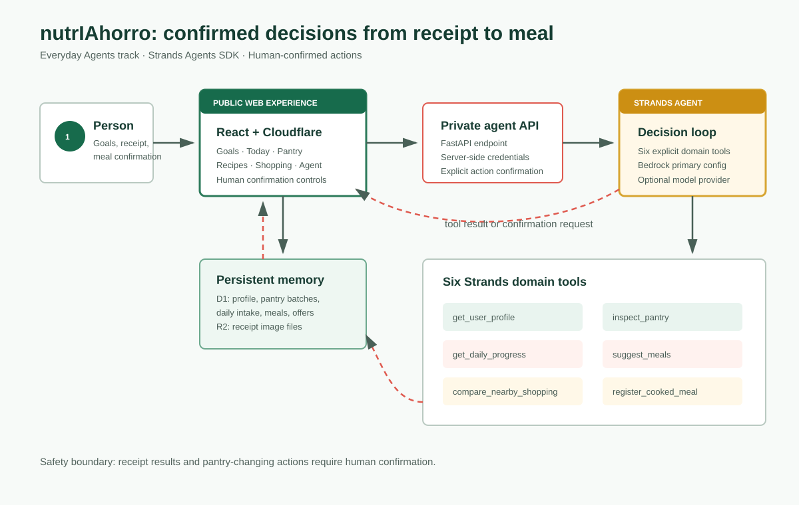

# nutrIAhorro

**An everyday agent that helps people eat with context, use food before it expires, and shop with the real cost of distance in mind.**

nutrIAhorro was built for the **Everyday Agents** track of the **Agents for Humans Hackathon**. It combines a persistent pantry, general wellness goals, receipt understanding, meal decisions, daily nutrition progress, and nearby shopping context in one coherent workflow.

[Open the live demo](https://nutriahorro.elartedeinvertir911.chatgpt.site)



## What it does

- Turns a receipt photo into editable pantry candidates and requires review before saving them.
- Requires human review before receipt results change persistent data.
- Tracks separate pantry batches and consumes the oldest safe batch first.
- Flags low stock and food that should be used soon.
- Calculates editable, general wellness calorie and macronutrient references.
- Shows calories, protein, carbohydrates, and fat for every recipe.
- Registers a cooked meal only after confirmation, updates all four daily totals, and deducts exact ingredient quantities.
- Suggests meals that fit available stock, preparation time, and protein preference.
- Compares demo grocery baskets with round-trip walking, bicycle, car, or motorcycle cost.
- Keeps working in an explicitly labeled deterministic demo mode if AWS is unavailable.

The Maldonado example uses fictional prices for El Dorado, Ta-Ta, Disco, and Tienda Inglesa. It does not claim live promotions. Nutrition references are general wellness information and do not replace professional care.

## Why it is an agent

The Strands agent chooses among six domain tools based on the person's request:

1. `get_user_profile`
2. `inspect_pantry`
3. `get_daily_progress`
4. `suggest_meals`
5. `compare_nearby_shopping`
6. `register_cooked_meal`

It reads current structured memory, combines goals with stock and time, explains a recommendation, and can complete a pantry-changing action after explicit confirmation. This is more than a chatbot response: the confirmed action updates the day's intake and persistent inventory together.

## Architecture

- **Web product:** React 19, vinext, and Cloudflare Workers.
- **Structured memory:** Cloudflare D1 for profile, goals, pantry batches, recipes, offers, uploads, and meal entries.
- **Receipt files:** Cloudflare R2.
- **Agent:** Strands Agents SDK with six explicit nutrition, pantry, meal, and shopping tools.
- **Model providers:** Amazon Bedrock is the primary configuration; OpenAI is an optional provider supported by Strands.
- **Public continuity mode:** the hosted demo uses a clearly labeled deterministic assistant when no private model endpoint is configured.

See [the architecture notes](docs/architecture.md). An optional, unused AgentCore deployment path remains documented in [the AWS guide](docs/aws-setup.md); AgentCore is not required by the hackathon and is not claimed as deployed.

## Demo data

The repository seeds an anonymous fictional profile and a sample pantry in Maldonado, Uruguay. No private account, real receipt, medical record, AWS credential, or promotional code is stored in source control.

## Run the web app

Requires Node.js 22.13 or later and pnpm.

```bash
pnpm install
pnpm dev
```

Open `http://localhost:3000`.

## Run the Strands agent locally

Requires Python 3.11 or later and credentials for one configured model provider.

```bash
cd agent
python -m venv .venv
source .venv/bin/activate
pip install -r requirements.txt
cp .env.example .env
uvicorn api:app --reload --port 8000
```

Set `NUTRIAHORRO_AGENT_URL=http://localhost:8000` only in the web app's private environment. AWS credentials belong in AWS roles or local credential storage, never in this repository.

Provider selection:

```bash
# Primary configuration
NUTRIAHORRO_MODEL_PROVIDER=bedrock

# Optional Strands provider
NUTRIAHORRO_MODEL_PROVIDER=openai
```

No paid model call is required to run the automated test suite. AgentCore packaging is included only as an optional future deployment path and is outside the submitted runtime.

## Verification

```bash
pnpm lint
pnpm build
pnpm exec tsc --noEmit
agent/.venv/bin/python agent/test_tools.py
agent/.venv/bin/python agent/test_models.py
```

## Submission material

- [Master delivery guide in Spanish](docs/ENTREGA-COMPLETA-ES.md)
- [Demo script](docs/demo-script-es.md)
- [Devpost copy](docs/devpost-submission.md)
- [Final checklist](docs/submission-checklist-es.md)
- [Privacy and safety](docs/security-privacy-es.md)

## License

MIT. See [LICENSE](LICENSE).
