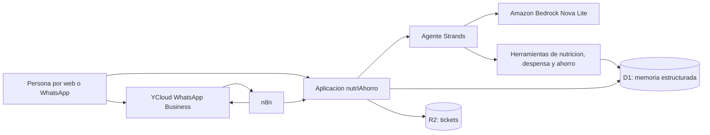

# Arquitectura de nutrIAhorro

## Flujo de una compra

1. La persona envia una foto del ticket o carga alimentos manualmente.
2. El archivo se guarda en R2 y los productos normalizados se escriben en D1.
3. La despensa calcula stock y prioridad de consumo por fecha.
4. El agente consulta perfil, preferencias, tiempo disponible y despensa.
5. Las herramientas proponen recetas y comparan una canasta cercana con el costo de traslado.
6. n8n prepara el resumen diario y YCloud lo entrega por WhatsApp.
7. Cuando la persona confirma que cocino, se descuentan los ingredientes y queda registro de la accion.

## Por que es un agente y no solo una aplicacion

El agente tiene memoria persistente, selecciona herramientas segun la intencion, combina varias fuentes y ejecuta trabajo de principio a fin. No se limita a conversar: consulta la despensa, compara compras, genera una recomendacion contextual y modifica stock solo despues de confirmacion.

## Herramientas Strands

- `get_user_profile`: recupera objetivos y preferencias.
- `get_pantry`: obtiene stock y prioridades de vencimiento.
- `suggest_meals`: crea alternativas con restricciones y tiempo disponible.
- `compare_shopping_options`: compara precio, distancia y transporte.
- `register_cooked_meal`: descuenta ingredientes con confirmacion explicita.
- `prepare_daily_summary`: produce el mensaje que recibe n8n.

## Decisiones de seguridad

- Las metas nutricionales se presentan como orientativas.
- No se diagnostican enfermedades ni se ajustan tratamientos.
- Las acciones que cambian stock requieren confirmacion.
- Los precios de la demo estan marcados como ficticios.
- Nunca se incluyen secretos en codigo o archivos exportados.
- Si Bedrock no responde, la interfaz utiliza una respuesta local limitada y segura.
